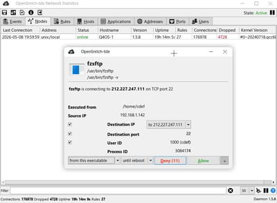
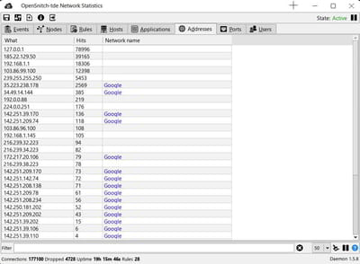
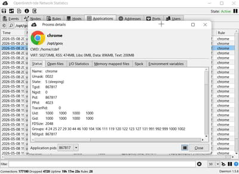
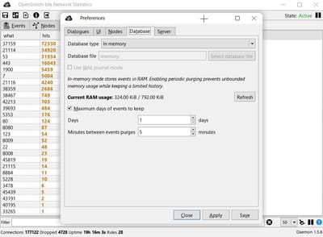
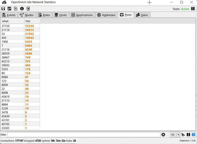
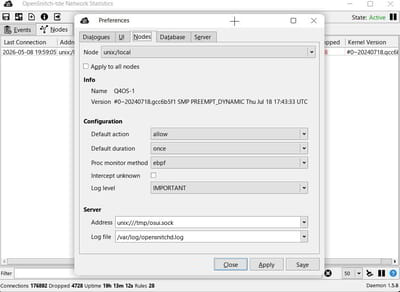
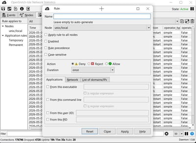

# OpenSnitch UI (TQt3 / TDE) - Native port


This repository contains a native C++ port of the original OpenSnitch graphical user interface.

## Credits / Upstream

OpenSnitch is an open source application firewall.

- **Original project (daemon + Python UI):** https://github.com/evilsocket/opensnitch
- This UI is a **port** of the upstream UI concepts and behaviors.
- All credit for the original design, features, and protocol belongs to the upstream authors and contributors.

## Goal of this port

The upstream UI is implemented in Python (Qt/PyQt). This port targets a **native TQt3 / TDE** application with:

- Faster startup (no Python runtime import cost)
- Lower runtime memory footprint
- A single native binary
- Reduced disk access at startup (embedded assets)

The goal is to keep behavior close to upstream while allowing a lightweight native desktop integration.

## Notable porting differences

This port is intentionally close to upstream, but some implementation details differ.

### Embedded icons / assets

To reduce disk accesses and improve startup time, various UI assets (icons/images) are embedded into the binary and used directly by the UI.

### SQLite usage and optimizations

The UI maintains its own local SQLite database for displaying events/statistics.

- **In-memory DB mode:** uses a shared in-memory SQLite URI (`file::memory:?cache=shared`) and applies pragmatic settings to reduce memory growth.
- **Optional WAL mode for file DB:** when using a file-backed database, WAL mode support is available (mirroring behavior introduced in upstream UI versions).
- **Batch inserts wrapped in transactions:** large stats updates are inserted under a single transaction to reduce SQLite commit overhead.

### Reverse DNS resolution

Upstream UI performs reverse DNS / hostname resolution using its Python implementation.

This port implements a **custom reverse DNS mechanism** integrated into the native UI flow. The intent is:

- Keep the UI responsive
- Avoid Python dependencies
- Ensure consistent results in the native environment

## Build

This UI is built as a native C++ application.

Typical build steps (example):

```sh
mkdir -p build
cmake -S . -B build
cmake --build build -j
```

## Notes

This is a UI-only port. The firewall logic remains in the upstream OpenSnitch daemon.

  
  
  
  
  
  
  

